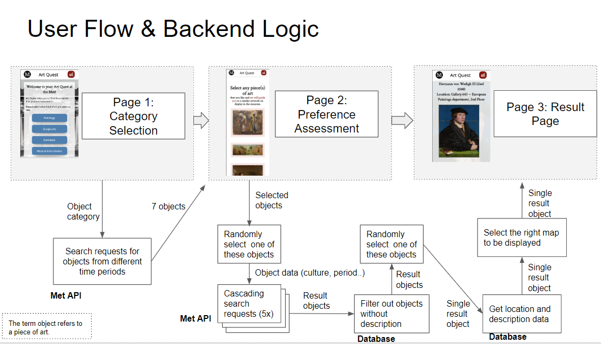

# Art-Quest (2nd Bootcamp project, week 6)
Give your next visit of the Metropolitan Museum in NYC greater aim. Art Quest will elicit your preferences and direct you to personalized highlights of works of art on display along with biographical and socio-historical context to enrich your visit.

## Motivation 
Visiting a huge museum, such as the Metropolitan, can be overwhelming for the vistor. Just like music, people like different types of art. In a big museum, chances are that you spend a lot of time walking through the halls and searching for pieces that you like. Wouldn't it be nice to have a little mobile helper to help you finding artworks that you actually like?

## Features and Logic

In the first screen the user has to indicate, which type of art she is interested in (paintings vs scultupres vs ...). Let's say the user chose paintings. This information is then used to make a query to the Metropolitan Museum API. In this query, we ask for all paintings that are currently on display in the museum and in order to guarantuee a minimum of diversity in the paintings that e show to the user in the next screen, we ask for paintings from different periods.

In the next screen, the user is shown seven paintings that were returned by the API. The user can select the paintings that she likes and move on. From the selected images we randomly select one and use the object data of the painting (period of creation, location of creation, culture  etc.) as constraints to formulate a new search query to the API in order to get similar paintings. If the API doesn't return anything we successively relax the constraints, until the API returns at least one similar painting. From the API response we randomly select one object, which will be shown to the user on the last screen. 

Since the Metropolitan API doesn't return information about where artworks can be found in the museum, we used a Scraper to get these information from the museum's website and to create a database. Accordingly, the information about the gallery and floor of a displayed painting, comes from this databse. 

We also wanted to provide the user with a map to help her find the artwork. In the first to screens, clicking on the map icon will open a modal with a map of the museum's main floor. However, on the last screen, where we recommend a certain artwork to the user, clicking on the icon will open a modal, with a map of the floor in which the artwork can be found.

## Visual overview

## Stack
**Backend:** Node, Express, Handlebars, MongoDB
**Frontend:** CSS, HTML, Javascript (DOM manipulation)
**Scraper:** Cheerio.js

## Credits
Fabian Scherer: https://github.com/fabianschu
William Brown: https://github.com/whbrown/
Metropolitan Museum: https://github.com/metmuseum/
